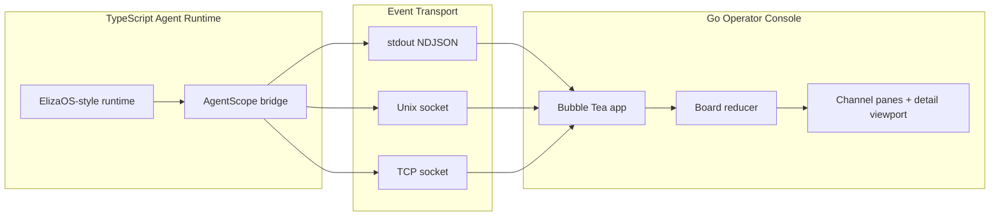

# AgentScope Architecture

AgentScope is split into two runtimes on purpose:

- A Go Bubble Tea console for rendering, keyboard navigation, and channel/event state reduction.
- A TypeScript bridge that lives next to the agent runtime and emits a stable NDJSON contract.

That separation keeps the UI process fast and dumb while the runtime stays free to evolve.

## Data Flow



## Contracts

The TypeScript side emits normalized events:

```json
{
  "time": "2026-04-19T12:00:00Z",
  "agent": "router",
  "channel": "intake",
  "kind": "channel_open",
  "status": "open",
  "topic": "New work routing",
  "members": ["router", "planner"],
  "message": "Opened intake channel",
  "roomId": "room-intake",
  "worldId": "solana-agents-prod",
  "source": "elizaos"
}
```

The Go side reduces those events into:

- `agents`
- `channels`
- `events`
- focused channel history
- event detail payloads

## Why This Boundary

- The UI does not depend on ElizaOS internals.
- The bridge can normalize different runtime event names without changing the console.
- Socket transport avoids the `stdin` conflict between live event input and Bubble Tea keyboard input.

## Recommended Live Setup

1. Start the console in listen mode.
2. Start the TypeScript bridge inside the agent runtime.
3. Emit `channel_open`, `channel_update`, `channel_close`, `message`, `chunk`, `action_started`, `action_completed`, `blocked`, and `error`.
4. Let the Go reducer derive panes and history from the stream.
